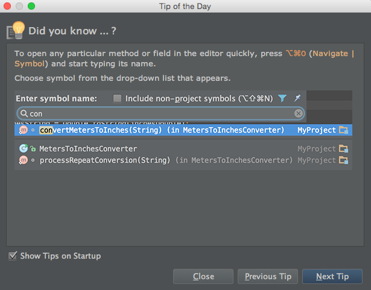
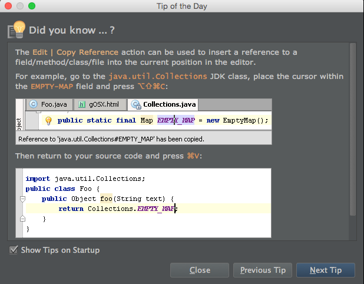
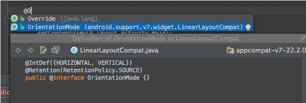
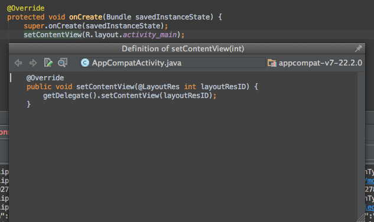

# AndroidStudio每日一贴

## 《AndroidStudio每日一贴》1.快速打开方法或字段

在编辑器中快速打开某个方法或字段, 使用快捷键: option + command + o(Navigate | Symbol) 然后开始输入名字.

更多实用技巧请查看[《AndroidStudio实用指南》](http://yuedu.baidu.com/ebook/31beb61a9b6648d7c1c746e8)

博客: http://blog.csdn.net/wirelessqa 作者: 老毕  

## 《AndroidStudio每日一贴》2.快速查看项目中最近的变更

快速查看项目中最近的变更,使用快捷键: option + shift +c

更多实用技巧请查看[《AndroidStudio实用指南》](http://yuedu.baidu.com/ebook/31beb61a9b6648d7c1c746e8)

博客: http://blog.csdn.net/wirelessqa 作者: 老毕  

## 《AndroidStudio每日一贴》3.快速切换代码风格、配色方案和键盘

快速切换代码风格、配色方案和键盘,使用快捷键: control + ~

更多实用技巧请查看[《AndroidStudio实用指南》](http://yuedu.baidu.com/ebook/31beb61a9b6648d7c1c746e8)

博客: http://blog.csdn.net/wirelessqa 作者: 老毕  

## 《AndroidStudio每日一贴》4.如何快速插入引用？

### 操作方法:

向当前正在编辑的字段/方法/类/文件中插入引用,可以使用Edit | Copy Reference 或 快捷键 option + command + shift + c

### 举个例子:

如下图所示，

第一步: 在Collection.java中,光标放在EMPTY_MAP上面, 使用快捷键 option + command + shift + c
第二步: 回到你要插入这个引用的地方, 按下command + v, Collections.EMPTY_MAP就会插入了.

更多实用技巧请查看[《AndroidStudio实用指南》](http://yuedu.baidu.com/ebook/31beb61a9b6648d7c1c746e8)

博客: http://blog.csdn.net/wirelessqa 作者: 老毕  

## 《AndroidStudio每日一贴》5. 如何快速查看某个方法/注解的定义？

### 操作方法:

使用快捷键 option + space 或 command + y

### 举个例子:

如下面的例子,我在输入@O的时候会出现代码补全列表,这个时候我想查看列表中项目的定义可以使用快捷键 option + space 或 command + y来查看.

查看方法的定义同上.使用快捷键 option + space 或 command + y来查看.

更多实用技巧请查看[《AndroidStudio实用指南》](http://yuedu.baidu.com/ebook/31beb61a9b6648d7c1c746e8)

博客: http://blog.csdn.net/wirelessqa 作者: 老毕  
